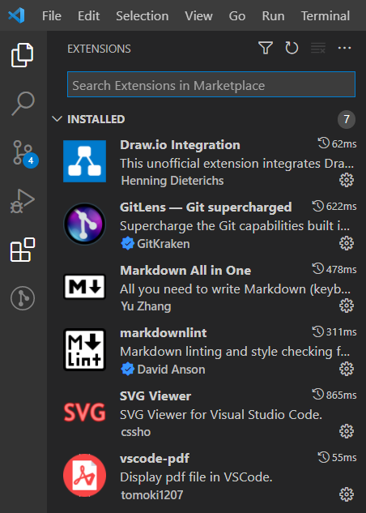
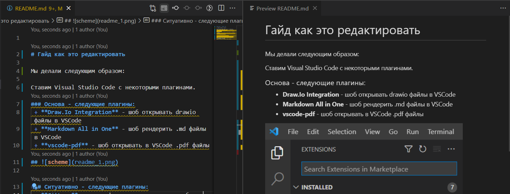

# Гайд как это редактировать

Мы делали следующим образом:

Ставим Visual Studio Code с некоторыми плагинами. 
##  
### Основа - следующие плагины:
 + **Markdown All in One** - шоб рендерить .md файлы в VSCode
    
 + **Draw.Io Integration** - шоб открывать drawio файлы в VSCode
 + **vscode-pdf** - шоб открывать в VSCode .pdf файлы

### Ситуативно - следующие плагины:
 + **GitLens** - много фич с гитом, мне нужно было смотреть кто сделал коммит определённой строчки
 + **markdownlint** - подсвечивает проблемные места при написании .md файла
 + **SVG Viewer** - Рендерить svg в VSCode

