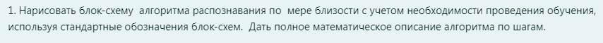
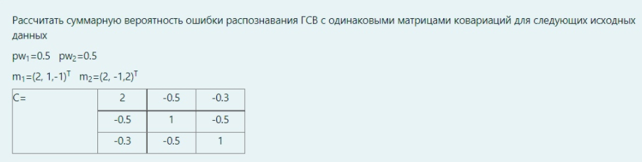
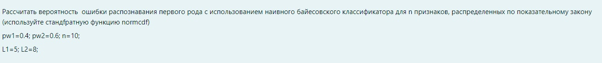
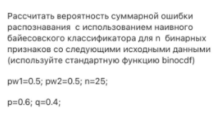
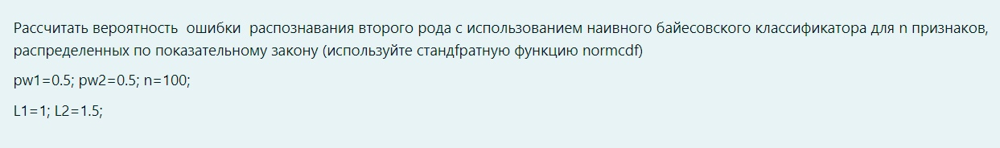
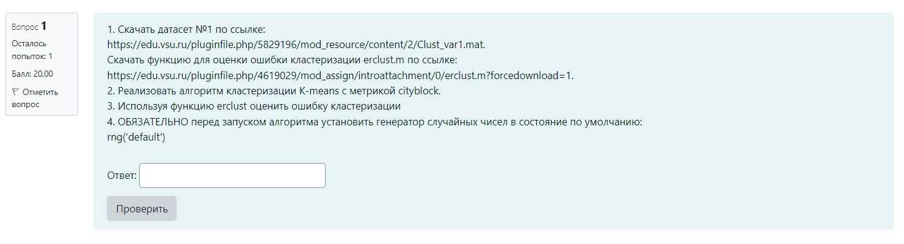
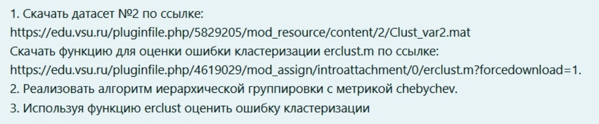
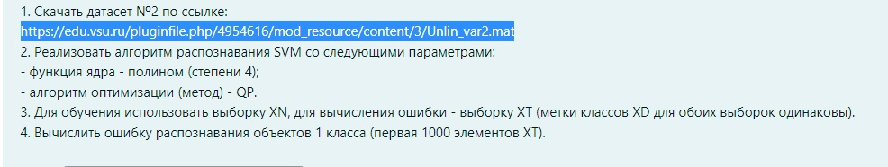
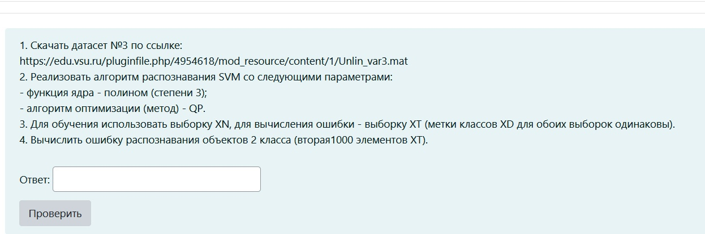
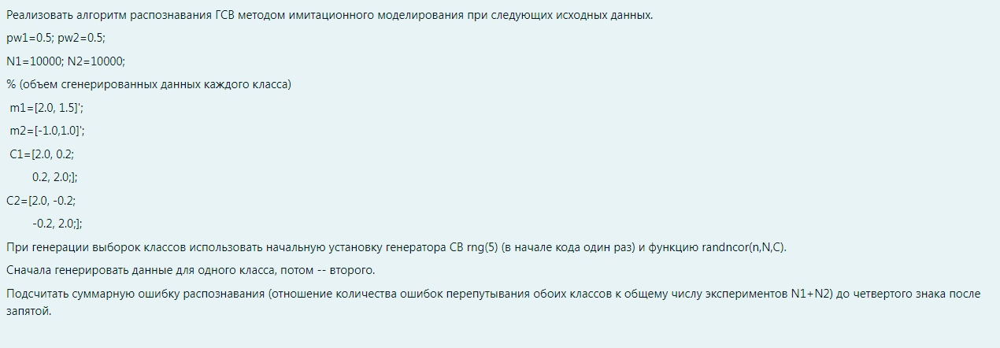

# Вопросы с экзамена

 1. Теория (1 вопрос)
    1. Нелинейные преобразования и спрямляющие пространства (полной формулировки нет к сожалению)
    2. блок-схему алгоритма распознавания гауссовских случайных векторов с одинаковыми матрицами ковариаций
    3. Дать математическое описание к построению алгоритмов распознавания на основе Random Forest. Нарисовать блок-схему алгоритма, используя стандартные обозначения блок-схем.
    4. !!! Нарисовать блок-схему алгоритма построения линейной регрессии, используя, стандартные обозначения блок-схем. Дать полное математическое описание алгоритма по шагам.  
    5. Дать математическое описание к построению алгоритмов распознавания на основе AdaBoost. Нарисовать блок-схему алгоритма, используя стандартные обозначения блок-схем.
    6. !!! Нарисовать блок-схему алгоритма распознавания с использованием ядерных оценок Парзена с учетом необходимости проведения обучения, используя стандартные обозначения блок-схем. Дать полное математическое описание алгоритма по шагам
    7. Нарисовать блок схему алгоритма распознавания по мере близости с учётом необходимости проведения обучения  
      
    8. Дать математическое описание к построению алгоритмов кластеризации различных типов при неизвестном количестве классов. Нарисовать блок-схему типового алгоритма, используя стандартные обозначения блок-схем.  
      (Это иерархическая???)
 2. Практика (2 вопрос)
    1. Рассчитать вероятность ошибки распознавания первого рода с использованием наивного байесовского классификатора для n бинарных признаков со следующими исходными данными (используйте стандартную функцию binocdf)
    pw1=0.3; pw2=0.7; n=5;
    p=0.9; q=0.2;
    1. Рассчитать вероятность суммарной ошибки распознавания ГСВ с различными матрицами ковариаций для следующих исходных данных  
    pw1=0.3; pw2=0.7; n=2;  
    m1=[2,1]'; m2=[2,2]';  
    C1=[1, -0.5;  -0.5, 1];  
    C2=[2, 0; 0, 2];  

    1. Рассчитать суммарную вероятность ошибки распознавания ГСВ с одинаковыми матрицами ковариации
      

    2. Рассчитать вероятность ошибки распознавания первого рода с использованием наивного байесовского классификатора для n признаков, распределённых по показательному закону (использовать normcdf)  
      
    3. Рассчитать вероятность суммарной ошибки распознавания первого рода с использованием наивного байесовского классификатора для n бинарных признаков, (использовать binocdf)  
      
    4. Рассчитать требуемое число испытаний (c округлением до ближайшего целого) для оценки вероятности ошибки при следующих исходных данных  
      Pош=0.01; dg=0.1* Pош; gamma=0.07;
    5. Рассчитать вероятность ошибки распознавания второго рода с использованием наивного байесовского классификатора для n признаков, распределённых по показательному закону (использовать normcdf)  
      

 3. Практика (3 вопрос)  

    1. Реализовать алгоритм распознавания ГСВ методом имитационного моделирования при следующих исходных данных.  
    pw1=0.5; pw2=0.5;  
    N1=10000; N2=10000;% (объем сгенерированных данных каждого класса)  
    m1=[2.0, 1.5]';m2=[-1.0,1.0]';  
    C1=[2.0, 0.2;0.2, 2.0;];  
    C2=[2.0, -0.2; -0.2, 2.0;];  
    При генерации выборок классов использовать начальную установку генератора СВ rng(5) (в начале кода один раз) и функцию randncor(n,N,C).  
    Сначала генерировать данные для одного класса, потом — второго.  
    Подсчитать суммарную ошибку распознавания (отношение количества ошибок перепутывания обоих классов к общему числу экспериментов N1+N2) до четвертого знака после запятой.

    2. Датасет 1
    

    3. Датасет 2 v1
    

    4. Датасет 2 v2
    

    5. Датасет 3
    

    6. Реализовать алгоритм распознавания ГСВ методом имитационного моделирования  
    

    7. Реализовать алгоритм распознавания ГСВ методом имитационного моделирования при следующих исходных данных.  
    n=2; M=2;  
    pw1=0.4; pw2=0.6;  
    N1=8000; N2=12000;% (объем сгенерированных данных каждого класса)  
    m1=[2.0, 1.5]';  
    m2=[-1.0,1.0]';  
    C=[2.0, 0.2;0.2, 2.0;];  
    При генерации выборок классов использовать начальную установку генератора СВ rng(4) (в начале кода один раз) и функцию randncor(n,N,C).  
    Сначала генерировать данные для одного класса, потом -- второго.  
    Подсчитать суммарную ошибку распознавания (отношение количества ошибок перепутывания обоих классов к общему числу экспериментов N1+N2) до четвертого знака после запятой.