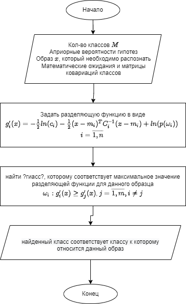
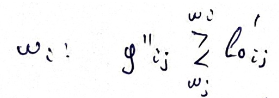

# ГСВ с различными матрицами ковариации

## 

1) Входными данными для этого алгоритма являются:

   + образ X
   + кол-во классов M 
   + априорные вероятности классов $p(\omega_i), i = \overline {1, M}$
   + функции правдоподобия  $f_x (x| \omega_i)= p (x|\omega_i) = N(x, m_i, c_i), i = \overline {1, M}$

   &ensp;&ensp;&ensp;&ensp;&ensp; 
   Где $N(x,m,c) = \frac{1}{(2 \pi)^{\frac{n}{2}} |c|^{\frac{1}{2}}} e^{-\frac{1}{2} (x - m)^T c^{-1} (x-m)}$

   + матрицы ковариации $C_i$ и математические ожидания $m_i$ для классов
   + Образ $x$

2) Будем использовать в качестве критерия MAB ?над M должны быть две точки? $g_i(x)=p(\omega_i) * p(x|\omega_i)$ Для удобства применим преобразование $g'_i(x)=ln(g_i(x))$ и вычтем общую константу $-(\frac{n}{2})ln(2\pi)$  
$g'_i(x) = -\frac{1}{2} ln(c_i) - \frac{1}{2}(x-m_i)^T C^{-1}_i (x-m_i) + ln(p(\omega_i)), i=\overline{1,m}$
3) Решение принимаются в пользу того класса, которому соответств макс значение разделяющей функции для данного класса  
$\omega_i : g'_i(x) \geq g'_j(x), i=\overline{1,M}, i \neq j$  
или можнопереписать в следующем виде  
$g''_{ij}(x) = -\frac{1}{2}ln(\frac{|c_i|}{c_j}) - \frac{1}{2} x^T (c^{-1}_1 - c^{-1}_2)x + x^T(c^{-1}_1 m_1 - c^{-1}_2 m_2) - \frac{1}{2} m_1^Tc_1^{-1}m_1 + \frac{1}{2} m_2^T c_2^{-1}$  
$l'_{0ij} = ln(\frac{p(\omega_j)}{p(\omega_i)})$  
  
В данном случае зависимость между разделяющей функцией и вектором признаков является квадратичной, следовательно, граница областей решений будет иметь норму разделичных поверхностей второго порядка.  
  
Пример для случая двух классов и вычисляются ошибки в лекции 4 на стр 7-10. ???