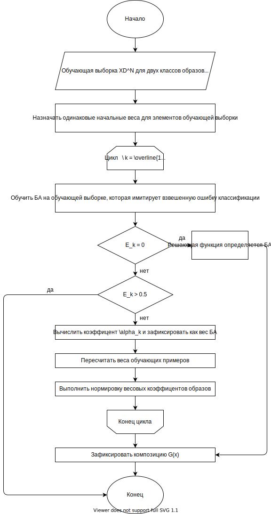

# AdaBoost

## 

### Математическое описание:

**Шаг 1:** 

Пусть имеется:  
- Обучающая выборка образов 
$XD^N = \{(x^{(i)},d^{(i)}),\; i= \overline{1,N} \}$
для двух классов образов $\omega_1, \omega_2 \; d^{(i)} \in$ {-1 ; -1};
- $L$ итераций;
- Базовый алгоритм (БА):  $\; g_k(x) = \left\{\begin{array}{l}+1,\;x\in\omega_1,\\-1,\;x\in\omega_2;\end{array}\right.$
- Итоговая композиция: $G(x)=sign[\sum\limits_{k=1}^L \alpha_k g_k(x)]$
- Число допущеных ошибок для БА: $\; E(g_k,w)=\sum\limits_{i=1}^N \omega_i I(g_k(x^{(i)})) \neq d^{(i)}, \; \sum\limits_{i=1}^N \omega_i = 1$;
- Общий функционал качества распознования, который надо инициализировать: $Q(g,\alpha) = \sum\limits_{i=1}^N M(x^{(i)}) = \sum\limits_{i=1}^N [d^{(i)} \sum\limits_{k=1}^L \alpha_k g_k(x^{i}) < 0] \rightarrow \min$

**Шаг 2:** 

Назначаем одинаковые начальные веса для элементов $XD^N \omega_0 = 1/N,\; i= \overline{1,N}$

**Шаг 3:**  
Цикл $k = \overline{1,L}$
  - Обучаем БА $g_k(x)$ на $XD^N$, который минимизирует взвешенную ошибку классификации $E_k=\min E(g_k, \omega);$
  - Если ошибка $E_k = 0$, то $G(x)=g(x)$ и переход к шагу 4; 
  - Если ошибка $E_k > 1/2$, то происходит окончание алгоритма;   
  - Вычислить $\alpha_k = \frac{1}{2}\ln(\frac{1-E_k}{E_k})$ и зафиксировать как вес БА;
  - Пересчитать веса обучающих параметров $\omega'_i = \omega_i \exp{(-\alpha_kg_k(x^{i}))}, i = \overline{1,N}$;
  - Выполнить нормировку весовых коэффицентов образов: $\sum\limits_{i=1}^N \omega'_i = 1$.

**Шаг 4:**  
Фиксируем композицию $G(x)=sign[\sum\limits_{k=1}^L \alpha_k g_k(x)]$

**Комментарии**  
В алгоритме при перевзвешивании наблюдений усиливается роль тех из них, на которых допущены ошибки. Большие веса получают те объекты, которые «плохо» классифицировались на предыдущих шагах. Весовые коэффициенты БА учитывают допущенные ими ошибки как напрямую, так и косвенно, через веса обучающих образов. Таким образом, на каждом последующем шаге новый классификатор приспосабливается исправить ранее допущенные ошибки предыдущих классификаторов. При выполнении алгоритма по схеме AdaBoost на каждом шаг добавляется новый классификатор, при этом значения коэффициентов БА, полученные на предыдущих шагах не изменяются.

[Лекция 11](../лекции%20с%20мудла/v11.pdf) стр. 14   
Целиком и полностью взято из лекций  