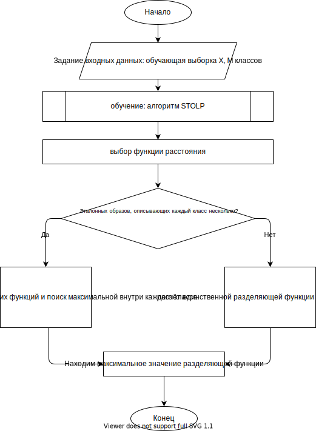

# STOLP с обучением

Вообще вопрос звучал так:  
> Нарисовать блок-схему алгоритма распознавания по мере близости с учетом необходимости проведения обучения, используя стандартные обозначения блок-схем. Дать полное математическое описание алгоритма по шагам.  

Тогда отвечаем следующим образом:
> Cначала списываем с алгоритмов распознавание по мере близости, потом списываем STOLP

Собственно это и проделано в этом файле.

## 

1) Задание исходных данных: обучающая выборка $X$, M классов образов

2) На основе алгоритма STOLP получаем из обучающей выборки эталонные образы. Для каждого класса может быть задан один эталонный образ $\omega_i:z^{(i)}$, $i=\overline{1,M}$ или конечное и одинаковое количество эталонных образов в виде множества $\omega_i : \Z^{(i)} = \{ z^{(i,k)}, k = \overline{1,L} \},\ i=\overline{1,M}$, являющихся стандартными вершинами одного и того же образа. Будем считать, что количество эталонов L.
3) Задаём функцию расстояния. Пусть это будет евклидово расстояние. Тогда расстояния между любым новым образом и эталонным образом каждого класса: $d^{(i)}_E(x,z^{(i)}) = (x-z^{(i)})^T (x-z^{(i)})^\frac{1}{2},\ i=\overline{1,M}$

4) Расчёт значений линейных разделяющихся функций. Для случая, когда эталонный образ внутри класса один:
    рассчитываем параметры разделяющей функции на основе эталонных векторов
    $$
        W^{(i)} = (z^{(i)}_1,...\ ,z^{(i)}_n), W^{(i)}_0 = -0.5(z^{(i)})^T z^{(i)}
    $$
    Разделяющие функции $g^{(i)}_E(x)=x^Tw^i + w^{(i)}_0,\ i=\overline{1,M}$, определяющиеся скалярным произведением вектора признаков и весовых векторов, равных эталонному.  
    Для случая, когда эталонных образов несколько:
    $$
        g^{(i)}_E(x)=\underset{k}{max}(x^Tz^{(i,k)} - \frac{1}{2}z^{(i,k)}),\ i=\overline{1,M}
    $$  
    Сначала рассчитываем Увклидово расстояние от $x$ до всех эталонов и находим минимальное. Выбор минимального расстояния эквивалентен выбору максимального значения разделяющей ф-и ??
5) Принимаем решение в пользу того класса, у которого расстояние от $x$ до эталона минимально среди всех расстояний до всех эталонных образов других классов. Это решающее правило эквивалентно выбору максимального значения разделяющей функции
    $$
        \omega_i: g^{(i)}_E\geq g^{(j)}_E(x),\ j=\overline{1,M},\ i\neq j
    $$

## Алгорим STOLP

[Тута](../!STOLP/STOLP.md)
