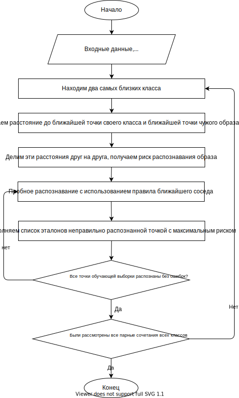

# STOLP

## 

1) Задана обучающая выборка  
    $X^{N_i} = \{x^{(i,1)},..,x^{(i,N_i)}\}$, $i=\overline{1,M}$  
    и классы $\omega$

2) Находим два самых близких класса.В качестве расстояния между классами $r(\omega_i, \omega_j)$ принимается расстояние между двумя самыми близкими образами обучающих выборок из разных классов.

3) Нахождение самых "напряженных" точек. Для каждого образа $x^{(i,K)}$ обучающей выборки класса $\omega_i$ определяются расстояния до ближайшей точки своего класса и ближайшей точки чужого образа  
    $$
        \rho^{(i)}_{kt} = \underset{t}{min} \ d(x^{(i,k)}, x^{(i,t)})
    $$  
    $$
        \rho^{(i)}_{k,out} = \underset{j,t}{min} \ d(x^{(i,k)}, x^{(i,t)})
    $$  
    $W^{(i)}_K = \frac{\rho^{(i)}_{kt}}{\rho^{(i)}_{k,out}}$ - характеризует величину риска для данного образа быть распознанным в качестве точки чужого класса
4) Выбираем один образ из каждого класса с максимальным значением величины $\underset{k}{max}W^{(i)}_K, i=\overline{1,M}$, заносим их в список эталонов

5) Пробное распознавание элементов с опорой на выделенные прецеденты и с использованием правила ближайшего соседа: образ относится к тому классу, расстояние до прецедентов которого минимально. 
   
        Среди точек, распознанных неправильно, выбирается точка с максимальным значениеми $W^{(i)}_k$ и ею пополняется список эталонов, после чего повторяется процедура пробного распознавания всех элементов. 
        Эта процедура продолжается до тех пор, пока пока все точки обучающей выборки не будут распознаваться без ошибок.

   

6) Повторяем шаги 2-5 для парных сочетаний всех классов. Если среди них окажется класс $\omega_i$ (или $\omega_j$) с выделенными на предыдущем этапе в качестве эталонов прецедентами, то эти прецеденты включаются с самого начала в рассмотрение и дополняются новыми в случае необходимости.
