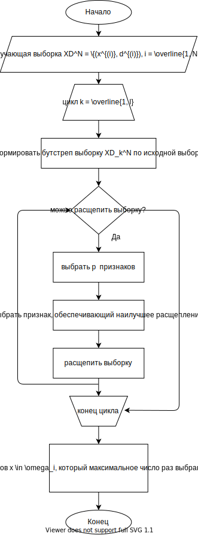

# Random forest

## Реализовать индукцию леса

В цикле для $k = \overline{1,L}$ деревьев ансамбля выполнить:

+ на исходной обучающей выборке $XD^N = \{(x^{(i)}, d^{(i)}), i = \overline{1, N}\}$ сформировать бутсреп выборку $XD^N_k$
+ по бутстреп выборке индуцировать неусеченное дерево решений $T_k$ c количеством наблюдений в терминальных вершинах, равным $n_{min}$:

    1) Из исходного набора n  признаков случайно выбрать p  признаков
    2) из p  признаков выбрать признак, который обеспечивает наилучшее расщепление
    3) расщепить выборку, соответствующую обрабатываемой вершине, на две подвыборки
    4) повторить рекурсивно

В результате получаем ансамбль деревьев решений $\{T_k,\ k= \overline{1, L}\}$

---

## Распознавание новых наблюдений

часть дальше есть в учебнике, но хз, наверное не обязательно

Выбирается класс образов  $x \in \omega_j$, который максимальное число раз выбран базовыми классификаторами:

$$
    \widetilde{d}(x) = i = \underset{j = \overline{1,L}}{\argmax}\{\sum\limits_{k = 1}^{L} I_k (x \in \omega_j)\}, \ I_k(x \in \omega_j) = \begin{cases}
        1, x \in \omega_j,\\
        0, x \notin \omega)j.
    \end{cases}
$$

Дальше какая-то всратая муть, которой нету ни в учебнике, ни в клауде, чекай сурс если хочеца, так же убрал ее из блок схемы (последний блок)
