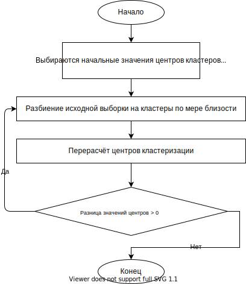

# K-means
!! В правильности решения можно сомневаться

## 

1) Выбираются начальные значения M центров кластеров
   $M_i, i=\overline{1,M}$, в качестве которых назначаются либо первые образы из исходной выборки $X^N$ (случайно по факту), либо $M$ наиболее удалённых друг от друга образов выборки (макс. алгоритм). Это есть начальное приближение, не означает, что оно останется. Оно позволяет начать с некоторой выгодной позиции.

2) Проводится разбиение $Q_M$={$x^{N_1}$,...,$X^{N_M}$} исходной выборки на кластеры(по мере близости берем каждый образ из обучающей выборки, находим расстояние до центра и относим в тот кластер, где расстояние это будет минимальным), в ходе которого принадлежность каждого образа опред. на основе поиска минимума среди расстояний до установленных ранее центров $m_i$, $i=\overline{1,M}$. Рассчит. начальное значение внутриклассового разброса $E_W(x^N, Q_M)$
3) Проводится перерасчёт центров с учётом разультатов выполненной в п.2 кластеризации
   $m_i=\frac{1}{N_i} \sum\limits_{k=1}^{N_i} x^{k,i}$, $i=\overline{1,M}$ и соотв. перерасчёт функции $E'_W(x^N,Q_M)$
4) Если разница значений на соседних шагах $\delta_{max} = max(m_i - m'_i) > \delta_0$, то осуществляем присвоение $m_i=m'_i$, $i=\overline{1,M}$ и переход к выполнению следующего шага в п.2 Иначе $-$ остановиться.

[Лекция 12](../лекции%20с%20мудла/v12.pdf) страница 17